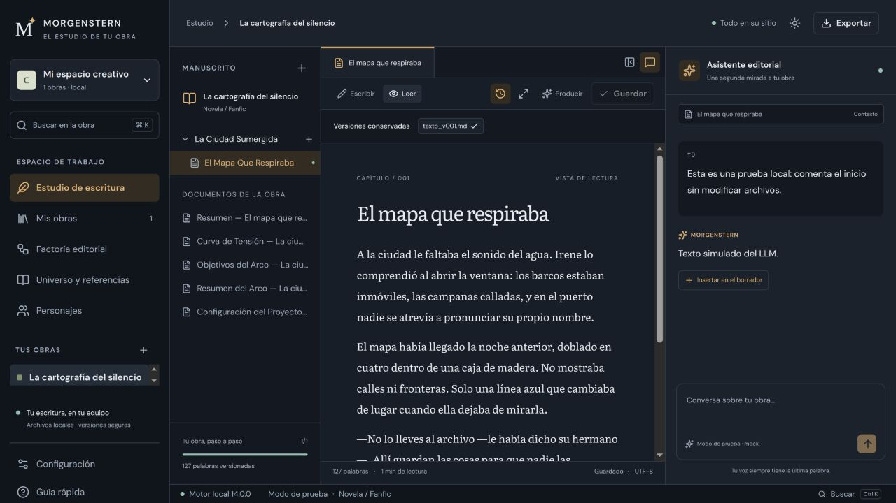
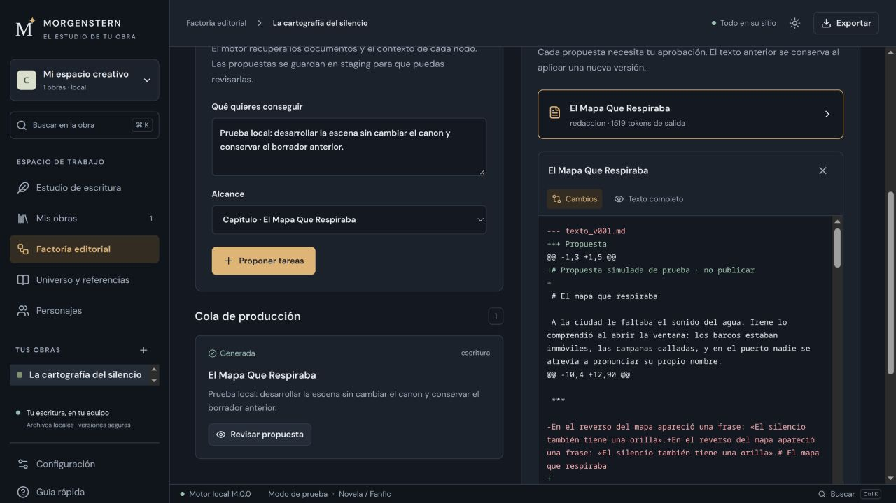

# Morgenstern / Generar no es entregar.

**Una línea de producción editorial con IA.** Ideas, estructura, capítulos, revisión, EPUB y audiolibro. El problema interesante no es pedirle texto a un modelo: es conservar el contexto de una obra, coordinar el trabajo y terminar con entregables revisables.

**React · Tauri 2 · Rust · Python · Automatización editorial**

## Nueva interfaz de escritorio · beta próximamente

Morgenstern incorpora un estudio de escritura oscuro por defecto: manuscrito, estructura de la obra y asistente editorial en un mismo espacio. La factoría permite proponer tareas, aprobar la producción y revisar los cambios antes de incorporarlos como una nueva versión.

**Estoy preparando una beta que pondré a disposición próximamente.** Todavía no hay fecha ni descarga pública de la aplicación. Este showcase se actualizará cuando pueda probarse.

Capturas reales de la interfaz del 1 de octubre de 2026, con una obra de prueba y respuestas simuladas. El diff de la factoría también corresponde a una propuesta de prueba; no acredita la calidad de un modelo ni una obra publicada.

- **Escribir y organizar:** obras con estructuras adaptadas a su esquema, documentos de referencia, personajes y editor Markdown con vista de lectura.
- **Conversar con contexto:** chat editorial vinculado a la obra o al nodo activo.
- **Conservar el control:** versiones del manuscrito, revisión de diffs y aprobación antes de incorporar propuestas.
- **Preparar la entrega:** exportación EPUB desde el estudio; el motor conserva los pipelines de audio y vídeo.

La interfaz utiliza React y Tauri 2. Python mantiene la orquestación de agentes y los servicios editoriales; Rust se encarga de hashes paralelos y de supervisar trabajos FFmpeg con límites y timeouts. La aplicación de producción no necesita Electron ni un proceso Node residente. El cliente de escritorio y los modelos locales son componentes separados.

[**Ver la nueva interfaz y el estado de la beta →**](https://calinrus-dev.github.io/morgenstern-showcase/) · [Estado y comprobaciones](docs/ESTADO.md)

## La obra manda

La estructura acompaña al contenido. La generación forma parte de un recorrido que incluye decisiones del autor y salida editorial. Morgenstern está orientado a producir a escala sin convertir cada libro en una carpeta de respuestas sueltas.

~~~text
Idea y esquema → Obra organizada → Generación coordinada
                                     ↓
                           Revisión y decisiones del autor
                                     ↓
                           EPUB / audio / entregables
~~~

[Recorrido del producto](docs/EXPERIENCIA.md) · [Responsabilidades y decisiones](docs/ARQUITECTURA.md)

## Abre una entrega. Después lee el código.

[**Entrega pública inspeccionable →**](https://calinrus-dev.github.io/morgenstern-showcase/) · [EPUB sintético](examples/sample.epub) · [Informe con hashes](examples/report.json)

Aquí hay dos piezas, con el origen bien separado:

- **Una adaptación del validador multimedia real:** [media_gate.py](samples/media_gate.py). Inspecciona streams y duración mediante ffprobe. Se ha desacoplado de la configuración privada y endurecido frente a NaN, informes malformados y procesos que se cuelgan.
- **Un generador nuevo para esta publicación:** [delivery_demo.py](samples/delivery_demo.py). Produce un EPUB mínimo determinista y un tono de un segundo. Sirve para repetir la comprobación sin proveedores, manuscritos ni cuentas. El tono no es un audiolibro y el generador no es el exportador privado.

~~~sh
python3 -m unittest discover -s test -v
python3 samples/delivery_demo.py
python3 samples/media_gate.py build/public-demo/tone.wav --minimum 0.9
~~~

Python 3.11+ y FFmpeg/ffprobe. En Windows: `py -3`. Sin dependencias Python adicionales. CI reproduce el EPUB y el WAV y los compara byte a byte con los publicados.

## Fallar antes de llamar «entrega» a un archivo

Un fichero con extensión correcta puede estar vacío. Una duración NaN se puede colar en una comparación inocente. Un vídeo sin audio puede ser válido como formato y no cumplir el contrato de un audiolibro audiovisual. Esas diferencias están en [pruebas ejecutables](test/test_delivery.py), no escondidas bajo un «todo OK».

La inspección de ffprobe comprueba contenedor, streams y duración; no escucha la narración ni decodifica cada frame. El EPUB tiene comprobaciones estructurales acotadas; no se anuncia certificación EPUBCheck. La muestra tampoco acredita una generación completa con IA, costes por libro ni calidad literaria.

**Automatizar producción exige conservar el control editorial. El botón de generar todavía no sabe editar.**

[Estado del producto](docs/ESTADO.md) · [Origen y límites](docs/PROVENANCE.md) · [Verificación](docs/VERIFICATION.md) · [Portfolio](https://github.com/calinrus-dev/portfolio)

[Instagram @c4linrus](https://www.instagram.com/c4linrus/) · [LinkedIn / calinrus](https://www.linkedin.com/in/calinrus-dev/)
