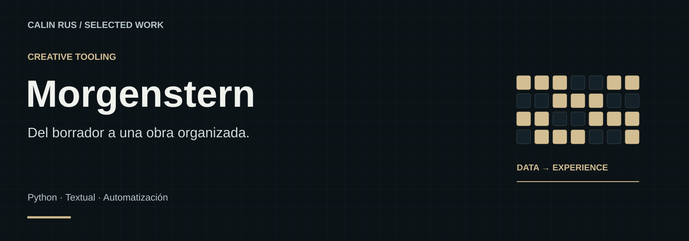
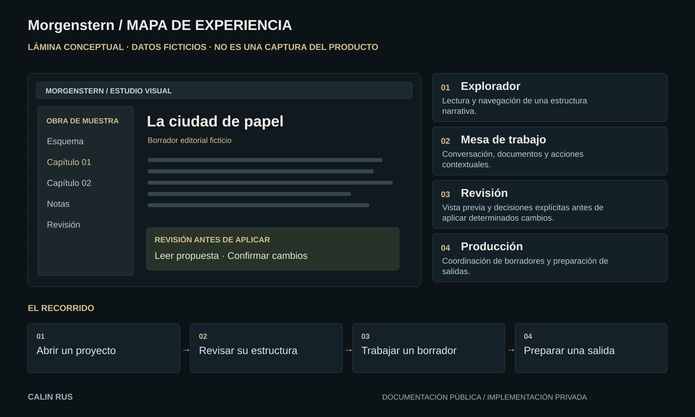

# Morgenstern

**Del borrador a una obra organizada.**

Un espacio de trabajo para organizar proyectos narrativos, explorar su estructura, revisar borradores y coordinar procesos de producción.

**Stack:** Python · Textual · Automatización  
**Estado:** Herramienta de autor en desarrollo

[Portfolio](https://github.com/calinrus-dev/portfolio) · [Experiencia](docs/EXPERIENCIA.md) · [Componentes](docs/COMPONENTES.md) · [Diseño técnico](docs/ARQUITECTURA.md) · [Demostraciones](docs/DEMOSTRACIONES.md) · [Estado](docs/ESTADO.md)

## El problema que aborda

Las notas, los capítulos y los resultados generados pueden perder contexto con facilidad. Morgenstern reúne navegación, revisión y procesos dentro del mismo proyecto creativo.

## Qué compone la experiencia

- **Explorador.** Lectura y navegación de una estructura narrativa.
- **Mesa de trabajo.** Conversación, documentos y acciones contextuales.
- **Revisión.** Vista previa y decisiones explícitas antes de aplicar determinados cambios.
- **Producción.** Coordinación de borradores y preparación de salidas.

*Lámina explicativa con datos ficticios. Su contenido también está disponible como texto en [Componentes](docs/COMPONENTES.md).*

## Decisiones que definen el proyecto

- **La obra conserva su contexto.** Estructura, borradores y revisiones pertenecen a un proyecto reconocible.
- **Ver antes de aplicar.** Las acciones sensibles deben presentar resultados y estado al autor.
- **Herramientas separadas del contenido.** La plataforma de trabajo y el material narrativo cumplen funciones distintas.

## Explorar el caso

- [Experiencia y recorrido](docs/EXPERIENCIA.md): intención, interacción y criterios de revisión.
- [Componentes](docs/COMPONENTES.md): las piezas visibles y el papel de cada una.
- [Diseño técnico](docs/ARQUITECTURA.md): responsabilidades y compromisos de diseño.
- [Demostraciones](docs/DEMOSTRACIONES.md): qué enseñan las imágenes y cómo leer la evidencia.
- [Estado y siguientes pasos](docs/ESTADO.md): alcance actual, comprobaciones y trabajo pendiente.

## Sobre este repositorio

Caso de estudio público de un proyecto con implementación privada. Reúne documentación, diagramas e imágenes seleccionadas. Los detalles del motor, integraciones, datos operativos y código se mantienen en los repositorios privados.

Revisión editorial: 28 de septiembre de 2026. Autor: [Calin Rus](https://github.com/calinrus-dev).

[calinrus.com](https://calinrus.com) · [Instagram @c4linrus](https://www.instagram.com/c4linrus/) · [Todos los proyectos](https://github.com/calinrus-dev/portfolio)
