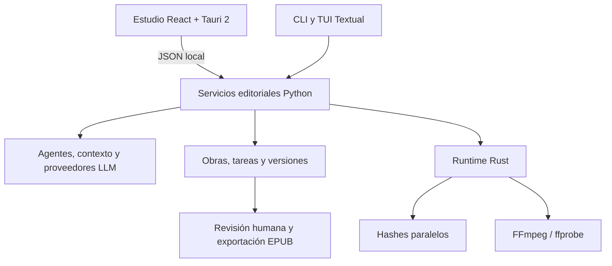

# Morgenstern / Diseño técnico

[← Inicio](../README.md)

## Responsabilidades

**React + Tauri 2** presentan el estudio de escritura y la factoría. El cliente usa el WebView del sistema y llama al motor mediante un protocolo JSON local, sin Electron ni un servidor Node en producción. Node se utiliza para desarrollo y compilación de la interfaz.

**Python** conserva la orquestación de agentes, los proveedores LLM, el contexto, el canon, los esquemas de obra, las tareas y el versionado editorial. La TUI Textual y el CLI headless siguen disponibles sobre los servicios compartidos.

**Rust** ejecuta hashes SHA-256 en paralelo y supervisa FFmpeg/ffprobe para audio y vídeo. Aplica límites de concurrencia, tiempos máximos y publicación de archivos temporales al terminar correctamente. FFmpeg sigue realizando la codificación multimedia.

## Datos y decisiones editoriales

La estructura depende del esquema de la obra: no todas las obras se reducen a arcos y capítulos. Las propuestas se conservan en staging y requieren revisión para incorporarse al manuscrito. Los guardados generan versiones y detectan conflictos con cambios posteriores.

Los modelos locales y los extras pesados de audio/embeddings se instalan según las necesidades del usuario. El tamaño del cliente de escritorio no representa el tamaño del motor Python, los modelos ni los recursos multimedia.

## Estado de la integración

El estudio integra EPUB y el flujo de revisión de la factoría. Los pipelines de audio y vídeo siguen accesibles desde el motor y el CLI. La beta se encuentra en preparación; [ESTADO.md](ESTADO.md) distingue comprobaciones locales, pruebas públicas y trabajo pendiente.
