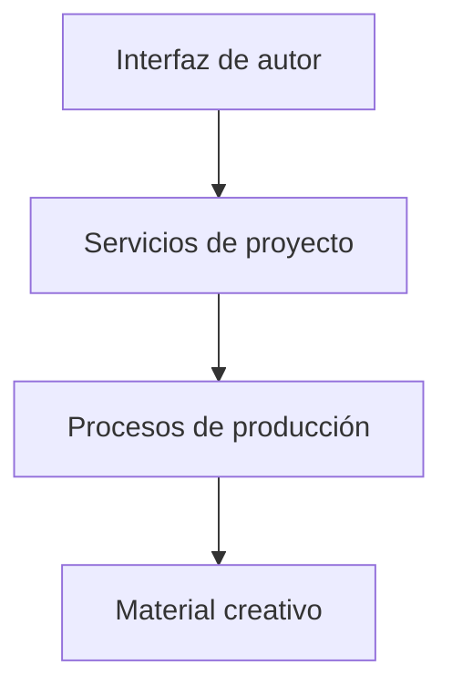

# Morgenstern / Diseño técnico

[← Inicio](../README.md)

## Contexto

Un espacio de trabajo para organizar proyectos narrativos, explorar su estructura, revisar borradores y coordinar procesos de producción.

**Tecnologías asociadas al proyecto:** Python · Textual · Automatización.

## Mapa de responsabilidades

Este mapa conceptual organiza la explicación del producto; no representa endpoints, procesos desplegados ni contratos internos.

## La obra conserva su contexto

Estructura, borradores y revisiones pertenecen a un proyecto reconocible.

## Ver antes de aplicar

Las acciones sensibles deben presentar resultados y estado al autor.

## Herramientas separadas del contenido

La plataforma de trabajo y el material narrativo cumplen funciones distintas.

## Rendimiento y dependencia

Mi criterio de trabajo es medir antes de optimizar: identificar el recorrido relevante, observar tiempo de respuesta y uso de recursos y comparar cambios con la misma carga. En sistemas nativos también me interesa la disposición de datos, la localidad de memoria y el trabajo repetido.

Local-first es una preferencia arquitectónica: conservar una experiencia útil y control sobre los datos en el dispositivo, e incorporar servicios externos cuando aporten una función concreta. Su alcance varía por proyecto; no implica que todas las integraciones de este caso funcionen sin conexión.

No se publican cifras de rendimiento sin un ensayo identificado. La evidencia específica disponible está en [Estado](ESTADO.md).

## Qué conviene demostrar después

- Consolidar navegación, estados y recuperación de sesiones.
- Demostrar un recorrido completo con una obra de muestra.
- Ampliar evidencia de exportación y revisión editorial.
