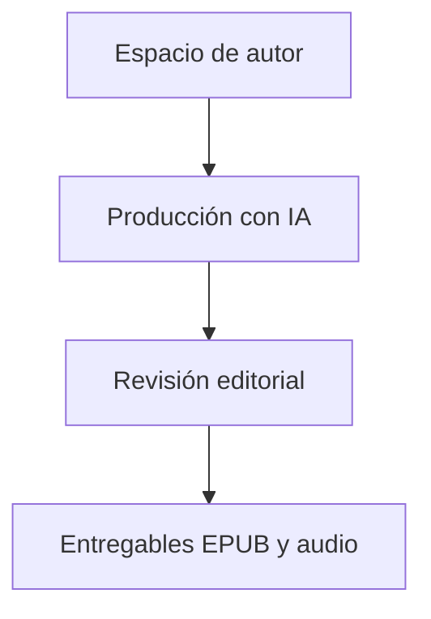

# Morgenstern / Diseño técnico

[← Inicio](../README.md)

## Contexto

Un sistema de automatización editorial con IA para transformar ideas, esquemas y borradores en obras organizadas, libros EPUB y audiolibros. Reúne generación, coordinación de producción, revisión y exportación en un mismo entorno de autor.

**Tecnologías asociadas al proyecto:** Python · Textual · Automatización.

## Mapa de responsabilidades

Este mapa conceptual organiza la explicación del producto; no representa endpoints, procesos desplegados ni contratos internos.

## La obra es la unidad de producción

Estructura, contexto y revisiones acompañan al material durante todo el proceso.

## Automatización con control editorial

La escala de producción necesita estados claros y decisiones explícitas del autor.

## La salida forma parte del sistema

La exportación a EPUB y audio se integra en el recorrido de trabajo.

## Rendimiento y dependencia

Mi criterio de trabajo es medir antes de optimizar: identificar el recorrido relevante, observar tiempo de respuesta y uso de recursos y comparar cambios con la misma carga. En sistemas nativos también me interesa la disposición de datos, la localidad de memoria y el trabajo repetido.

Local-first es una preferencia arquitectónica: conservar una experiencia útil y control sobre los datos en el dispositivo, e incorporar servicios externos cuando aporten una función concreta. Su alcance varía por proyecto; no implica que todas las integraciones de este caso funcionen sin conexión.

No se publican cifras de rendimiento sin un ensayo identificado. La evidencia específica disponible está en [Estado](ESTADO.md).

## Qué conviene demostrar después

- Preparar un caso público completo con una obra de muestra propia.
- Mostrar la continuidad entre generación, revisión y exportación.
- Ampliar evidencia de producción y recuperación de trabajos.
